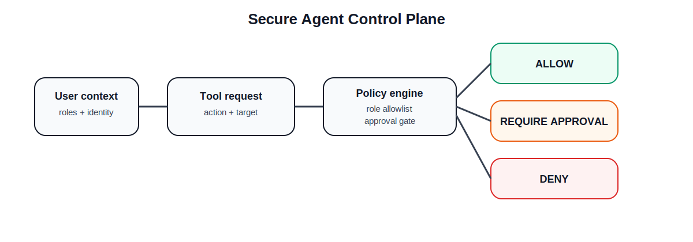

# Secure-Agent-Control-Plane

[](https://github.com/Popoo2020/Secure-Agent-Control-Plane/actions/workflows/ci.yml)
[](LICENSE)

**Secure-Agent-Control-Plane** is a policy-first security architecture lab for governing **agentic AI systems**.  
It demonstrates how role-aware authorisation, tool allowlists, approval gates, and audit logging can be applied before an AI agent performs sensitive actions.

> **Status:** working security-control baseline / active expansion.  
> Designed as a portfolio-grade prototype for AI Security, IAM, and secure automation roles.



## What is implemented

| Capability | Status |
|---|---|
| Role-based tool authorisation | ✅ Implemented |
| Read vs write action sensitivity | ✅ Implemented |
| Approval gates for sensitive actions | ✅ Implemented |
| Policy decision model: allow / deny / require approval | ✅ Implemented |
| Structured audit events | ✅ Implemented |
| Example policy engine tests | ✅ Implemented |
| CI test workflow | ✅ Implemented |
| External identity provider integration | 🟡 Planned |
| Policy-as-code DSL | 🟡 Planned |
| Live tool execution broker | 🟡 Planned |

## Why this project matters

Agentic AI systems become risky when:
- tools are too broadly available,
- users and agents share unclear permissions,
- write actions execute without approval,
- there is no traceable audit path.

This project demonstrates a **control plane** that sits between:
1. the user,
2. the AI agent,
3. and the tools the agent may request.

## Repository structure

```text
src/
  models.py             # Dataclasses for users, tools, requests and decisions
  policy_engine.py      # Authorisation and approval-gate logic
  audit.py              # Structured audit event builder

tests/
  test_policy_engine.py
  test_audit.py

samples/
  example_requests.json

.github/workflows/
  ci.yml

assets/
  agent-control-plane.svg
```

## Core decision model

The policy engine returns one of:

- `ALLOW`
- `DENY`
- `REQUIRE_APPROVAL`

Example:

```python
from src.models import UserContext, ToolDefinition, ToolRequest
from src.policy_engine import evaluate_request

user = UserContext(user_id="analyst-001", roles=("security_analyst",))
tool = ToolDefinition(
    name="create_ticket",
    allowed_roles=("security_analyst", "security_manager"),
    action_type="write",
    requires_approval=True,
)
request = ToolRequest(user=user, tool=tool, target="incident-4242")

decision = evaluate_request(request)
print(decision.outcome)
print(decision.reason)
```

## Security assumptions

- Tool access is denied by default unless the role is explicitly listed.
- Sensitive write actions can require approval even when the role is permitted.
- The policy engine should evaluate a request **before** tool execution.
- Audit events should capture:
  - actor,
  - tool,
  - action type,
  - decision,
  - and reason.

## Quickstart

```bash
git clone https://github.com/Popoo2020/Secure-Agent-Control-Plane.git
cd Secure-Agent-Control-Plane

python -m venv .venv
source .venv/bin/activate

pip install -r requirements.txt
pytest -q
```

## Roadmap

1. Add policy files in YAML/JSON
2. Add service identity / agent identity separation
3. Add risk score thresholds
4. Add explicit “human-in-the-loop” approval objects
5. Add simulated execution broker
6. Add audit log export to JSONL

## Portfolio value

This repository demonstrates practical understanding of:
- Agentic AI security
- IAM and least privilege
- Tool allowlisting
- Human approval gates
- Traceability and auditability
- Secure-by-design automation

## Limitations

- This is a security-control prototype, not a production IAM platform
- It currently evaluates policy decisions only; it does not execute real tools
- The model is intentionally compact so that the logic is easy to review
